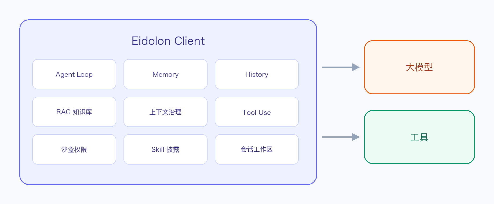
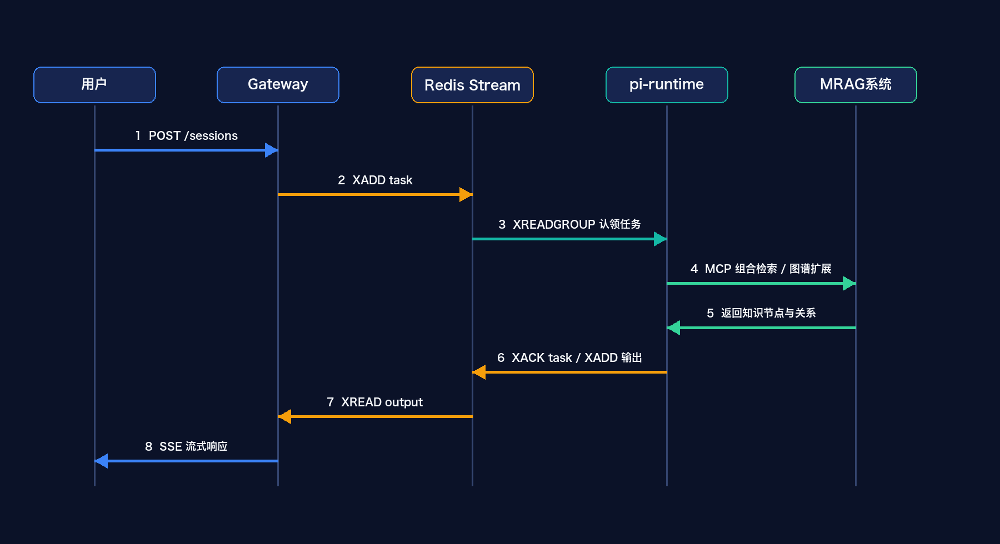

# Eidolon

多租户 Agent 执行平台（对外品牌 **Eidolon**），支持会话管理、SSE 流式输出、bwrap 沙盒隔离、MCP 工具扩展、Skill 渐进式披露、本地知识库管理。

---

## 信念

无论面向哪个垂直领域，Agent 都有一套共性能力：**Agent Loop、Memory、History、RAG 知识库、上下文治理、Tool Use、沙盒权限、Skill 披露、会话工作区**等。这些不应由每个开发者各自再造一套，而应收敛为**稳定、可迭代的底层基座**。

真正的产品价值不在于重复堆叠引擎，而在于：

1. **专业工具**：提供垂直领域的外部工具 / MCP，接入真实世界能力  
2. **经验与知识积累**：辅助用户沉淀、复用与分享 Skill / 经验（含私有知识），形成可复用的领域资产  

**基座负责「会思考、能记住、能检索」且可替换；产品价值在「专业工具」与「帮用户攒经验、攒知识」。** 这才是我们认同的 Agent 开发范式，也是本项目的产品与工程取舍准则。

---

## 整体架构

### 图 1 系统总体架构



系统分为知识构建与检索层、Agent 服务层、运行交互层。知识构建与检索层将多模态文档转化为可检索知识节点；Agent 服务层通过 MCP 调用检索工具并按 Skill 控制工具范围；运行交互层负责会话、沙盒执行和流式结果呈现。

### 图 2 Agentic RAG 协作时序



用户发送问题后，Gateway 创建会话并以本机 HTTP 直连派发任务给 pi-runtime；pi-runtime 在沙盒中运行 Agent，任务完成后以 HTTP 回写 session 状态。Agent 通过 MRAG 系统的 MCP 调用组合检索或图谱检索；Token、工具调用和工具结果以 HTTP 实时推送给 Gateway-SSE，落本地 SQLite `turn_events` 表并以 SSE 推送至前端，支持断线续传与历史回放。

---

| 服务 | 端口 | 技术栈 | 职责 |
|------|------|--------|------|
| **frontend** | 3000 | React + Vite + Tailwind | 对话界面（含模型配置、会话级文件管理入口）、Skill / MCP / 知识库配置管理页 |
| **cm-server** | 8000 | Python FastAPI（单进程） | 合并原 gateway/gateway-sse/admin/llm-proxy/mcp-proxy：会话 CRUD、任务派发、SSE 流式输出、MCP/Skill/知识库配置、LLM 代理 |
| **arxiv-mcp** | 8081（仅内网） | arxiv-mcp-server | 平台内置 arXiv MCP（Streamable HTTP），经 cm-server 内的 mcp-proxy 模块暴露 |
| **nature-mcp** | 8082（仅内网） | 自研 nature-mcp | 平台内置 Nature/Science 检索（OpenAlex/S2/Crossref/Unpaywall），仅元数据+合法 OA |
| **pi-runtime** | 8090 | Node.js 执行引擎 | Agent 任务执行、bwrap 沙盒隔离、Unix socket 网络白名单 |

CM 桌面架构下单机单用户场景不再需要按 QPS/并发连接数/下游调用量分别独立扩容，原 5 个
Python 服务已合并为 `cm-server` 单进程（内部仍按原服务边界分模块，见
[cm-server/README.md](cm-server/README.md)）。会话、LLM/MCP 配置、Skill 元数据统一存于
本地 SQLite 单文件库（`data/local.db`），任务派发/增量事件通过服务间直连 HTTP 完成，
不再依赖外部 Redis/MongoDB。

---

## 快速开始

```bash
# 一键部署（首次运行自动创建 .env）
bash deploy.sh

# 访问
# 前端        → http://localhost:3000
# CM Server   → http://localhost:8000/docs

# 启动后在前端管理页面配置 LLM Provider（base_url / api_key / model）
```

CM 桌面架构下 `cm-server` 与 `pi-runtime` 均基于本机内存态调度单实例 session，
不支持多实例水平扩展，`docker-compose.yml` 仅用于 Electron 打包前的本机调试，
不再提供生产集群 override（详见 [cm-server/README.md](cm-server/README.md)、
[pi-runtime/README.md](pi-runtime/README.md)）。

---

## 打包 mac 桌面客户端

```bash
# 一键打 mac arm64 安装包（.dmg，需 Apple Silicon Mac；不依赖 Docker）
bash deploy.sh --package
```

产物：`electron/release/Eidolon-1.0.0-arm64.dmg`（约 200MB+，双击后拖到 Applications 安装）。
同目录的 `.dmg.blockmap` 只是增量更新索引，不是安装包。

桌面端不再用 Docker/nginx；Electron 主进程拉起 `cm-server`、`pi-runtime`，并把
`pi` CLI + 扩展打进安装包。本地数据在 `~/Library/Application Support/onenew-desktop`。
详见 [electron/README.md](electron/README.md)。

---

## 目录结构

```
eidolon-platform/
├── README.md              # 本文件
├── deploy.sh              # Docker 本机调试 / --package 打 mac arm64 .dmg
├── docker-compose.yml     # 单节点编排
├── .env.example
├── frontend/              # React + Vite 前端
├── cm-server/             # FastAPI 单进程服务：合并原 gateway/gateway-sse/admin/llm-proxy/mcp-proxy
├── pi-shared/             # Python 服务共享工具库（日志、中间件、SQLite 访问层）
├── arxiv-mcp/             # 平台内置 arXiv MCP（HTTP sidecar）
├── nature-mcp/            # 平台内置 Nature/Science 学术检索 MCP（HTTP/stdio）
├── pi-runtime/            # Node.js 执行引擎（沙盒内 agent 运行时）
├── electron/              # Electron 主进程：拉起 cm-server/pi-runtime 子进程 + 本机静态代理
└── scripts/               # 打包构建脚本（build-frontend/build-pi-runtime/build-cm-server/package-mac）
```

---

## 文档

| 文档 | 说明 |
|------|------|
| [docs/agent-system-architecture.md](docs/agent-system-architecture.md) | 系统架构设计 |
| [docs/pi-internal-flow.md](docs/pi-internal-flow.md) | Pi 内部执行流程 |
| [docs/sandbox-cgroup-delegation.md](docs/sandbox-cgroup-delegation.md) | 沙盒 session cgroup 宿主机委托配置 |
