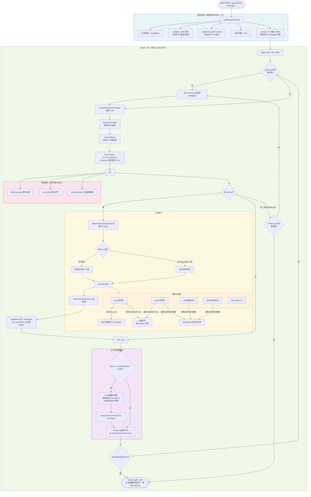

# Pi 进程内部流程图

## 完整流程：从用户输入到流式输出



## 各阶段说明

### 启动阶段（一次性）

| 步骤 | 说明 |
|------|------|
| buildSystemPrompt | 拼装工具列表、Guidelines、Skills 索引、MEMORY.md 指引、当前日期/cwd |
| Skills 索引 | 只在 system prompt 放名字+描述+路径，SKILL.md 内容不展开（渐进式披露） |
| JSONL 恢复 | `--session-dir` + `--session {sessionId}` 加载上次对话历史，恢复 messages[] |

### Agent Loop

每次用户发消息执行一轮完整 loop，循环直到无 tool call 且无 follow-up 消息。

| 阶段 | 说明 |
|------|------|
| Steering 队列 | tool 执行期间外部注入的消息，在下一个 turn 开始前消费 |
| LLM 调用 | 流式请求 llm-proxy，逐 token 推送 thinking/text/toolcall delta 到 stdout |
| 工具执行 | 默认并行，含 sequential 标记的工具串行；Extension 可拦截前后处理 |
| Compaction | tokens 超限时自动触发，LLM 摘要旧消息，保留最近 20K tokens |
| JSONL 持久化 | 每轮结束自动写盘，pi 重启后完整恢复 |
| Follow-up 队列 | agent 本应结束时检查，有则继续执行 |

### 三层记忆

| 层级 | 存储位置 | 生命周期 | 作用 |
|------|---------|---------|------|
| 短期记忆 | pi 进程 messages[]（内存） | session 进程存活期间 | LLM 推理上下文 |
| 短期记忆恢复 | `pi-sessions/{sessionId}.jsonl`（磁盘） | 永久（用户不删则不删） | pi 重启后恢复完整对话历史 |
| 长期记忆 | `memory/MEMORY.md`（磁盘） | 永久（跨 session） | 跨 session 关键信息共享 |

### 工具与记忆的关系

```
read(SKILL.md)   → Skill 内容进 messages[]，指导当前任务执行
read(MEMORY.md)  → 读取跨 session 记忆，了解历史背景
write(MEMORY.md) → 更新跨 session 记忆，记录重要发现
bash/edit/write  → 操作 workspace/ 文件，结果持久保留
```

## 其他能力（未在图中展示）

| 功能 | 说明 |
|------|------|
| Branch 摘要 | 切换历史分支时 LLM 生成摘要插入 context |
| Extended Thinking | off/minimal/low/medium/high/xhigh 六级思考深度 |
| terminate: true | 工具返回此标志，整批都返回时跳过下一次 LLM 调用 |
| 并行结果顺序保证 | 并发执行但 toolResult 按 LLM 请求顺序写回 |
| Session HTML 导出 | 可导出完整对话为 HTML（test_pi 未启用） |
